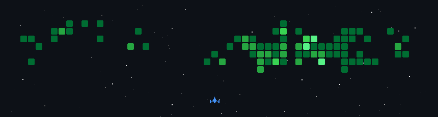

## Hi there 👋

<!--
- 👯 I’m looking to collaborate on ...
- 🤔 I’m looking for help with ...
- 💬 Ask me about ...
- 🔭 I’m currently working on Crack segment by using U2Net
- 😄 Pronouns: ...
- ⚡ Fun fact: ...
-->

- 🌱 I’m currently working on LLM/VLM fine-tuning and PPE detection from the perspective of drones
- 📫 How to reach me: q2205773452@163.com / xztszy@gmail.com

热爱分享开源软件，如有需求，尽管联系

I love sharing open-source software, so feel free to contact me if you need anything

**我希望自己走过的路，后来的人能走的更轻松**

**I hope the path I've walked will be easier for those who come after me**

